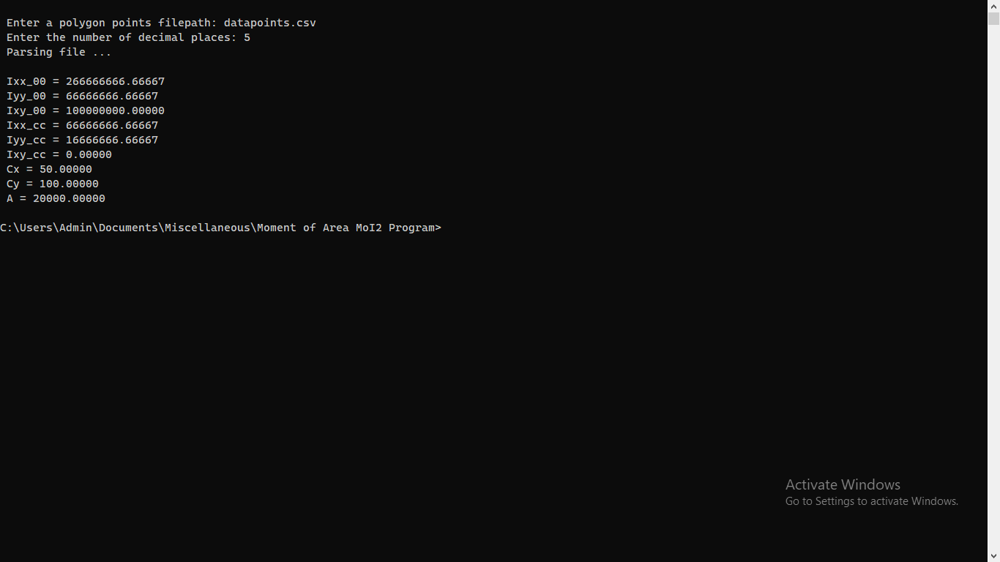
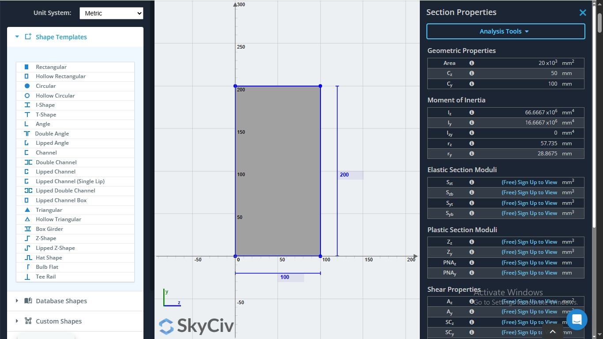
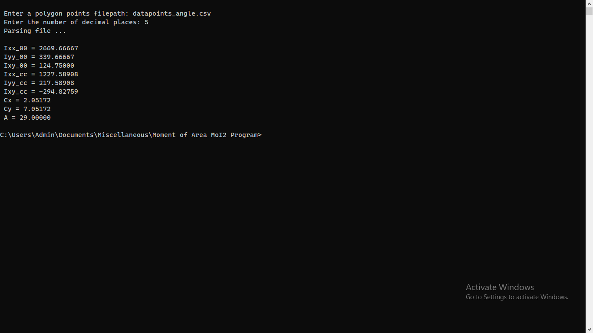
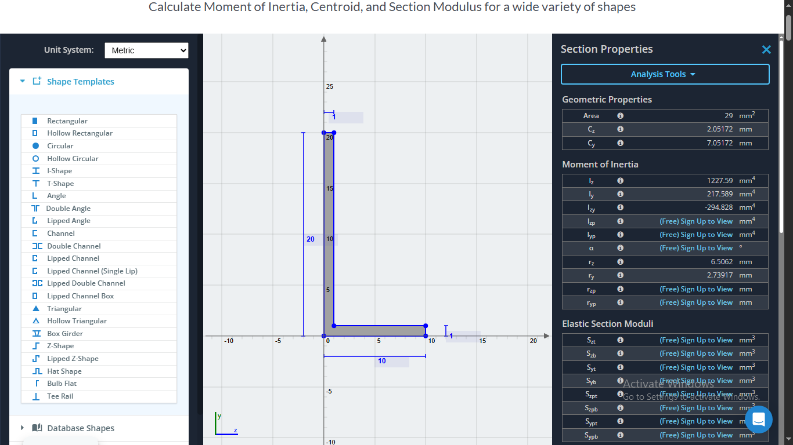
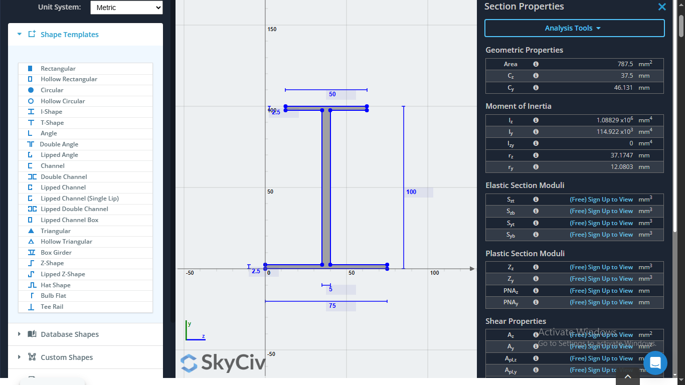
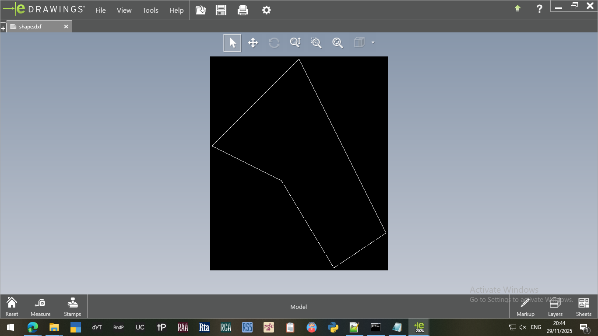
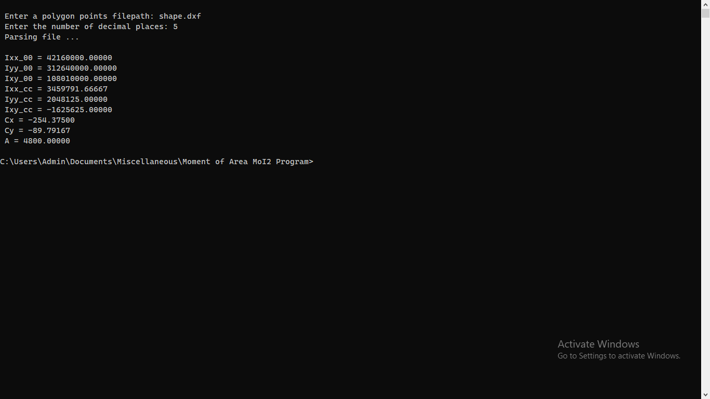

# Moment of Area (MoI2) Program

Calculate second moment of inertia (moment of area) from DXF shapes or CSV datapoints using Python.

---

### To use:
1. Open cmd.exe
2. Type py MoI2.py
3. Enter the relevant `*.dxf` shape or `*.csv` datapoints filename.
4. Enter the decimal places for output precision.
5. Make use of the produced results.

---

### Screenshots

  

  

  

